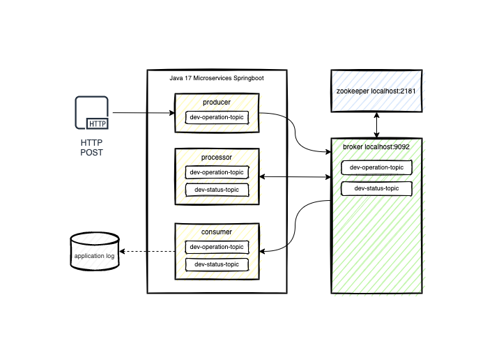

# dev-kafka
Desenvolvimento de um projeto para estudo da mensageria Apache Kafka

```bash
# Clone este repositório
$ git clone https://github.com/tiagomassashi/dev-kafka.git
```



#### Download Apache Kafka:
https://downloads.apache.org/kafka/3.3.1/kafka_2.13-3.3.1.tgz

#### Iniciar Zookeeper Server:
```bash
$ bin/zookeeper-server-start.sh config/zookeeper.properties
```

#### Iniciar Kafka Server:
```bash
$ bin/kafka-server-start.sh config/server.properties
```

#### Criar tópicos:
```bash
$ bin/kafka-topics.sh --create --bootstrap-server localhost:9092 --replication-factor 1 --partitions 10 --topic dev-operation-topic
$ bin/kafka-topics.sh --create --bootstrap-server localhost:9092 --replication-factor 1 --partitions 10 --topic dev-status-topic
```

## Funções
### Asynchronous process:
- URL: http://localhost:8080/producer/api/v1/operations
- Method: POST
- Body:
```json
{
    "customerId": 1,
    "customerName" : "Tiago Massashi Nagata",
    "orderValue": 1000.21,
    "orderDate": "2022-10-08"
}
```

### H2 Console:
- URL: http://localhost:8082/consumer/h2-console

```yaml
url: jdbc:h2:mem:dev
username: sa
password:
```
